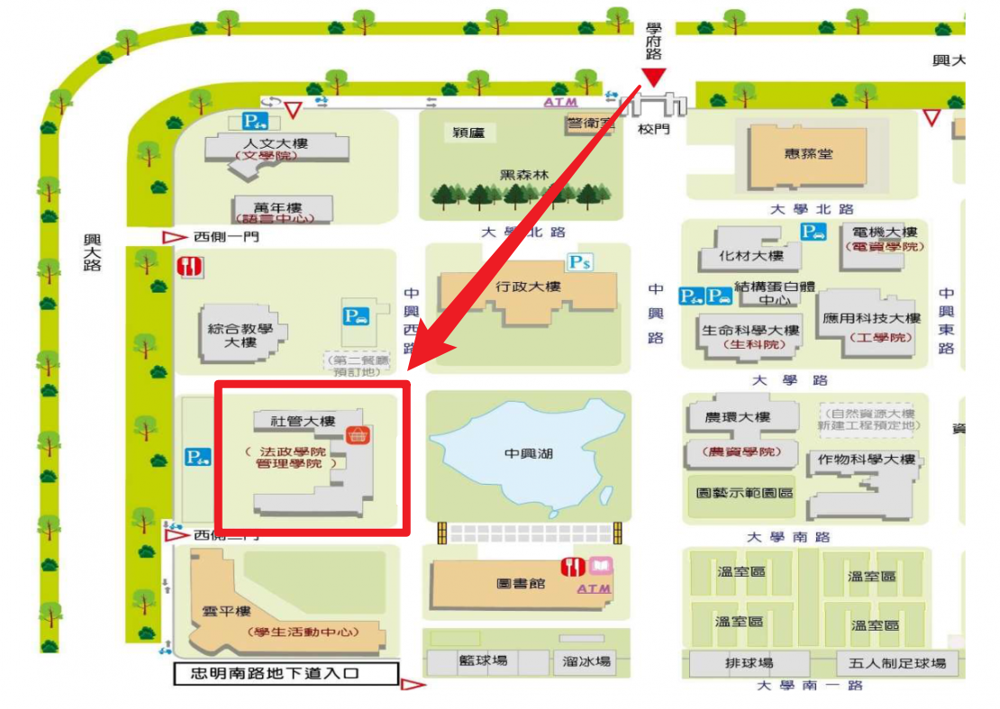

# [主旨] [Kindly Reminder］中興大學[OOO]/[OOO]/[OOO]_[日期] [時間] 口試

[OO]老師您好：

感謝老師撥冗擔任我們碩士論文的口試委員，再次附上口試當日相關資訊供老師參考：

日期：[20OO/OO/OO]  
時間：[早上9:00]  
地點：中興大學社管大樓  

口試學生：[OOO]、[OOO]、[OOO]

下圖為社管大樓地圖位置，老師當日可直接開車入校，大樓週邊停車格均可停放車輛。
若搭乘高鐵、火車或計程車，請老師幫忙留存相關票根及收據。
再次感謝老師百忙中抽空前來指教，謝謝老師。

敬請教安

